# Containerize Your World using Azure Kubernetes Services

This session will show you how to get started with Azure Container Service (AKS),
one of the most powerful ways of running containerized applications in Azure.
You'll learn how to set up a Kubernetes cluster using the Azure Cloud Shell and
deploy a highly available and scalable web application with only a few commands.
We'll then show how easy it is to scale up, reconfigure or update your
application without any incurring any downtime to users.

**Daniel Scott-Raynsford**

_Continuous Delivery Practice Lead, IAG NZ_

[Microsoft Cloud and Datacenter MVP](https://mvp.microsoft.com/en-us/PublicProfile/5002340?fullName=Daniel%20%20Scott-Raynsford) | [@dscottraynsford](https://twitter.com/dscottraynsford) | [Linked-In](https://www.linkedin.com/in/dscottraynsford/) | [Email](mailto:dscottraynsford@outlook.com) | [GitHub](https://www.github.com/PlagueHO)

## Content

- [What You Will Need](#what-you-will-need)
- [Prerequisite Knowledge](#prerequisite-knowledge)
- [What You Will Learn](#what-you-will-learn)
- [Part 1 - Opening a Cloud Shell](#part-1---opening-a-cloud-shell) - 5 min
- [Part 2 - Create an Azure Container Service](#part-2---create-the-azure-container-service) - 5 min
- [Introduction to Containers, Docker and Kubernetes](#introduction-to-containers,-docker-and-kubernetes) - 30 min
- [Part 3 - Manage Cluster with Cloud Shell](#part-3---manage-cluster-with-cloud-shell) - 5 min
- [Part 4 - Deploy your First Application](#part-4---deploy-your-first-application) - 10 min
- [Part 5 - Scale out your First Application](#part-5---scale-out-your-first-application) - 10 min
- [Part 6 - Editing a Deployed Application](#part-6---editing-a-deployed-application) - 15 min
- [Part 7 - When Disaster Strikes](#part-7---when-disaster-strikes) - 5 min
- [Part 8 - Using Helm](#part-8---using-helm) - 5 min
- [Part 99 - Cleanup After the Workshop](#part-9---cleanup-after-the-workshop) - 5 min

Estimated workshop time: 90 min
Estimated Azure credit usage: USD 3.00 (as long as you delete
the infrastructure straight after completion of the workshop)

## Prerequisite Knowledge

- Basic knowledge of Compute and Virutalization (Hyper-V, VMWare, Cloud compute)
- Basic knowledge of text editors (Notepad++ or Vim or VS Code)
- Basic knowledge of using text based consoles (Bash, Cmd, PowerShell)

## What You Will Learn

You'll learn the basics in the following skills:

- Create and use the Azure Cloud Shell.
- Use the Azure CLI (`az`) to create and delete an Azure Container Service.
- Use the Kubernetes tools (`kubectl`) to deploy and manage highly available
  container applications.

## What You Will Need

To complete this workshop you'll need the following:

- A **Microsoft Azure Account**.
  You can sign up for a free trial [here](https://azure.microsoft.com/en-us/free/).
- A computer running **Windows**, **OSX** or **Linux** (desktop OS)
  with an **up-to-date version** of either Chrome, Firefox, Edge or Opera.

## Part 1 - Opening a Cloud Shell

Azure Cloud Shell is an interactive, browser-accessible shell for managing
Azure resources. It provides the flexibility of choosing the shell experience
that best suits the way you work. Linux users can opt for a Bash experience,
while Windows users can opt for PowerShell.

1. Open Cloud Shell by clicking the Cloud Shell icon:
   

> If you have **not** previously used Azure Cloud Shell:


1. Click **Bash (Linux)**

   _When you first create a Cloud Shell a storage account will get created
   for you to store your settings, scripts and other files you might create. This
   enables you to have access to your own environment no matter what device you're
   using._

   

1. Select the **subscription** to create the Storage Account in and click
   **Create storage**.
1. The Storage Account will be created and the Cloud Shell will be started:

   

> If you have previously used Azure Cloud Shell:

1. Select **Bash** from the shell drop down:

   

## Part 2 - Create an Azure Container Service

We will now use the Cloud Shell to create a new Azure Container Service (ACS)
Kubernetes cluster that will be used to host our containers.

Any ACS service you create will be publically accessible on the internet.
A URL will be automatically assigned to your ACS service that you will be
able to use to access your containers and manage your cluster.

1. Launch an **Cloud Shell** in the Azure Portal or as a standalone console:

   [](https://shell.azure.com)

1. Depending on your type of subscription (Free, Azure Pass etc.) you may
   have to register the required resource providers. This is because by
   default many resource providers (types of resource providers) are not
   registered by default.

   This only needs to be done once for a subscription. To do this, run
   the following commands in Cloud Shell:

   ```bash
   az provider register --namespace Microsoft.Network
   az provider register --namespace Microsoft.Compute
   az provider register --namespace Microsoft.Storage
   az provider register --namespace Microsoft.ContainerService --wait
   ```

   

1. Come up with a **name** for your Azure Kubernetes Service. The name must contain
   only letters and numbers and be globally unique because it will be used for
   the public URLs of your cluster.

1. Run this command in Cloud Shell, but change `<set me please>` to the
   **name** that you specified above.

   ```bash
   name="<set me please>"
   ```

   **Important: Please note this value and command down, because if your Cloud
   Shell closes the value will be removed and you'll have to define it in your
   Cloud Shell session again by re-running this command.**

1. Run this command your Cloud Shell to create a resource group:

   ```bash
   az group create --name $name-rgp --location EastUS
   ```

1. Run this command in Cloud Shell to create a Azure Kubernetes Service
   cluster:

   ```bash
   az aks create --name $name --resource-group $name-rgp --location EastUS --dns-name-prefix $name --generate-ssh-keys --node-count 2
   ```

The AKS cluster will be created in your Azure subscription.
This will take at least 10 minutes to complete creation of the AKS.


## Part 2a - Configure Health Monitoring (Optional)

Azure Kubernetes Service clusters can be hooked up to Azure Log Analytics
(Azure Monitor) so that the health of the cluster can be monitored.

This feature is currently in preview, so it can only be deployed by
applying an ARM template to the AKS cluster resource group.
This will require a Log Analytics workspace already configured.

   ```bash
   name="<set me please>"
   workspaceId="$(az resource list --resource-type Microsoft.OperationalInsights/workspaces --query '[0].id' --o tsv)"
   aksResourceId="$(az aks show --name $name --resource-group $name-rgp --query id --o tsv)"
   wget https://gist.githubusercontent.com/PlagueHO/1c0b0ee8a5a6b2b0893c5ed0d74e4580/raw/7c91bfbb7f059a3992d9dc41965fee72716caa3f/deployaksloganalytics.json
   az group deployment create --resource-group $name-rgp --template-file deployaksloganalytics.json --name 'deployanalytics' --parameters aksResourceId=$aksResourceId aksResourceLocation="East US" workspaceId=$workspaceId workspaceRegion="Australia Southeast"
   ```

## Part 3 - Manage Cluster with Cloud Shell

Once your AKS has been created you will be able to review the AKS serivce
resource that has been created:


The actual infrastructure running the cluster gets installed into another
resource group:


The cluster itself should be managed by the AKS resource, not within the actual
infrastructure deployed.

Now that our cluster is deployed we need to configure Cloud Shell to be able
to manage it.

Kubernetes clusters always expose a management endpoint that the Kubernetes tools
and other software can use to control and monitor the cluster with. The FQDN
for this endpoint can be located by selecting the AKS cluster resource in the
resource group that we deployed to contain our cluster:


We can then configure the `kubectl` tool to manage this cluster. We could do this
manually, but the `Azure CLI` in Cloud Shell provides a handy way to do this for us.

1. Configure your Cloud Shell to manage your ACS by running the command:

   ```bash
   az aks get-credentials --resource-group $name-rgp --name $name
   ```

   

1. Validate our cluster is running by running the command:

   ```bash
   kubectl cluster-info
   ```

   

1. Check all nodes in the cluster by running the command:

   ```bash
   kubectl get nodes
   ```

## Part 4 - Deploy your First Application

We are going to start by deploying a simple two-tier voting web application:

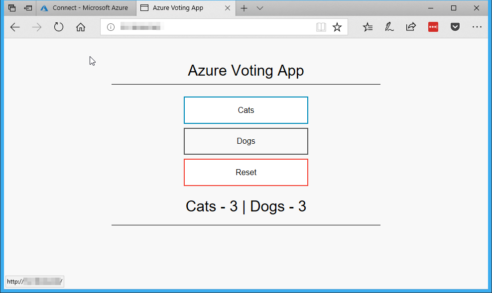

This application will contain two _Deployments_:

- **azure-vote-front** which will run a one or more _Pods_ hosting the
  web application containers. This will run on Port 80. A load balancing
  _Service_ will be configured to provide external access to the _Pods_.
- **azure-vote-back** which will run a single Redis cache container. This
  provides a cache so that the `azure-vote-front` end can share state data.
  This will be exposed on Port 6379 and will only be able to be accessed
  by the `azure-vote-front` _Pods_.

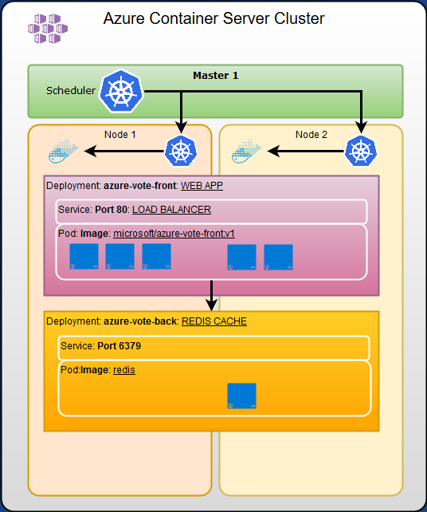

We will deploy this application by downloading the _Deployment_ file and
applying to the cluster. This will start the cluster automatically deploying
the application by downloading container images from the internet (Docker Hub)
and creating containers from them.

> Note: We could use a private container registry like Azure Container Registry
> to pull the container images from if we had private container images we had
> created.

You can review the _Deployment_ file by [clicking here](src/azure-vote.yml).

1. Download a Kubernetes _Deployment_ file for the demo app to your Cloud Shell:

   ```bash
   wget https://raw.githubusercontent.com/PlagueHO/AzureGlobalBootcamp2018/master/src/azure-vote.yml
   ```

1. Create the application by telling Kubernetes to create the _Deployments_
   and _Services_ using the _Deployment_ file by running this command in the
   Cloud Shell:

   ```bash
   kubectl create -f azure-vote.yml
   ```

1. Wait for the Kubernetes _Service_ to be started and become accessible
   by running this command in the Cloud Shell:

   ```bash
   kubectl get service azure-vote-front --watch
   ```

   _This may take a few minutes for the application images to be downloaded
   to the cluster and the application to be started up. Once the external IP
   address appears then the application is up and ready for us to use:_

   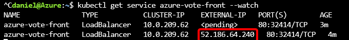

1. Once the _Service_ reports an `EXTERNAL-IP` <kbd>CTRL+C</kbd> to exit
   watching.

1. Copy the `EXTERNAL-IP` address of YOUR application into the browser and
   your app should be shown:

   

   Congratulations! You are now running your first Kubernetes application.

   

1. Now let us look at the _Deployments_ on the Kubernetes cluster by
   running this command in Cloud Shell:

   ```bash
   kubectl get deployments
   ```

   This shows the applications deployed to the cluster and the number of
   replicas of each _Pod_:

   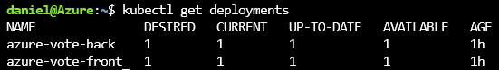

1. We can get a list of all the services running on the cluster by executing
   this command in Cloud Shell:

   ```bash
   kubectl get services
   ```

   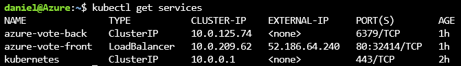

1. Finally, lets find out which nodes the _Pods_ are running on by
   executing this command in Cloud Shell:

   ```bash
   kubectl get pods -o wide
   ```

   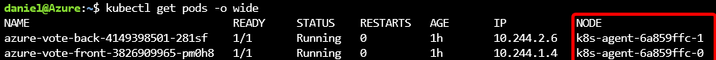

   _This command enables us to see which _Pods_ are running on each
   Kubernetes agent. Normally we wouldn't worry to much about this, but we
   want to watch what happens **later** when we shut down one of our agents._

## Part 5 - Scale up your First Application

One of the awesome features of Kubernetes is how easy it is to scale up
(or down) our _Pods_ so that more replicas of a container run in it.

We can easily scale individual _Pods_ or configure autoscaling to let
Kubernetes manage the scale of indivual _Pods_ based on the load.

1. To scale the front end _Pod_ of our vote demo we can run the following
   command in our Cloud Shell:

   ```bash
   kubectl scale deployment azure-vote-front --replicas=3
   ```

   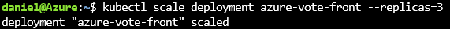

1. Now have a look at the _Pods_ that are running on our agents
   by executing this command in Cloud Shell:

   ```bash
   kubectl get pods -o wide
   ```

   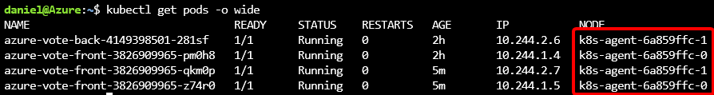

1. Lets now set up the front end Pod to automatically scale between 2 and 5
   containers when the containers run at 75% CPU utilization by executing
   this command in our Cloud Shell:

   ```bash
   kubectl autoscale deployment azure-vote-front --min=2 --max=5 --cpu-percent=75
   ```

   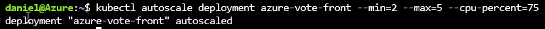

## Part 6 - Editing a Deployed Application

Each _Deployment_ file that has been applied to a cluster is stored
within the Cluster master as a file and can be modified to apply changes
to the _Deployments_ and _Services_ in flight.
This enables reconfiguring almost any aspect of the _Deployment_ file
and have the changes applied to the _Deployments_ and _Services_ immediately.

For example, if we wanted to update the container image version of the
running containers to a new version then we could edit this file.
So, we'll now update to V2 of our running app without any user disruption
at all. This is the power of Kubernetes.

1. First, describe all the _Deployments_ on the cluster by running
   this command in Cloud Shell:

   ```bash
   kubectl describe deployments
   ```

1. To edit a _Deployment_ file, execute the following command in Cloud
   Shell:

   ```bash
   kubectl edit -f azure-vote.yml
   ```

   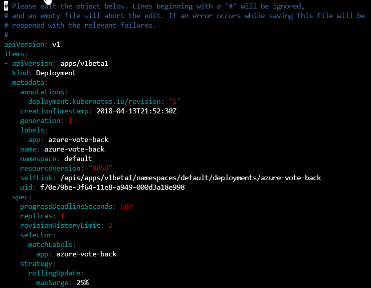

   _This will open VIM to edit the file in Azure Cloud Shell, which if you're
   not familiar with it might be a little bit tricky._

1. Search for the text `azure-vote-front:v1` in by pressing <kbd>/</kbd> on
   your keyboard and then entering `azure-vote-front:v1` and press
   <kbd>enter</kbd>. This should locate the line that matches:

   ```yaml
   image: microsoft/azure-vote-front:v1
   ```

   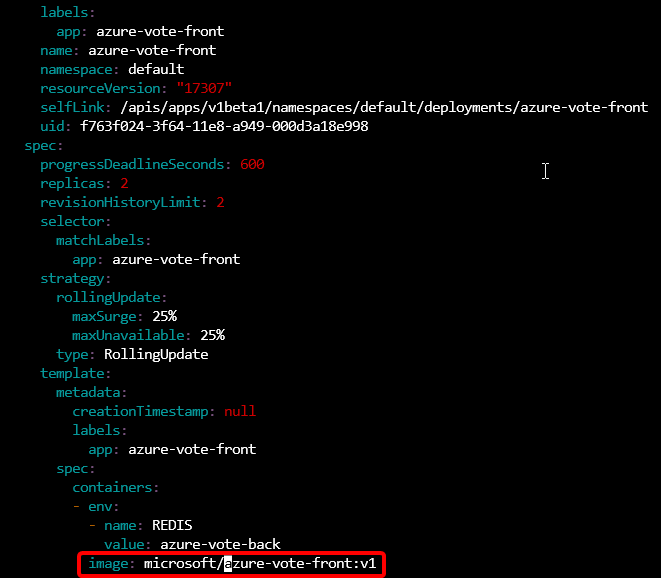

1. Press <kbd>i</kbd> to enter _insert text_ mode and change the image to v2:

   ```yaml
   image: microsoft/azure-vote-front:v2
   ```

   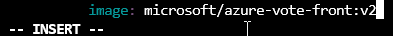

1. Press <kbd>esc</kbd> to exit _insert text_ mode.

1. Press <kbd>:</kbd> and then press <kbd>w</kbd> and then <kbd>enter</kbd>
   to write the file.

   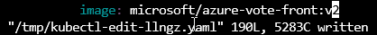

1. Press <kbd>:</kbd> and then press <kbd>q</kbd> and then <kbd>enter</kbd>
   to quit VIM.

> Alternately, if you get stuck with the VIM part, you can use this
> simple command to set the image that the `front-vote-front` deployment
> should run by executing this command in the Cloud Shell:
> ```bash
> kubectl set image deployment azure-vote-front azure-vote-front=microsoft/azure-vote-front:v2
> ```

   The changes to your Deployment will now be applied. A n  ew version of
   the container image will be downloaded and new containers deployed using
   it. As each running container is deployed the old version will be
   terminated.

   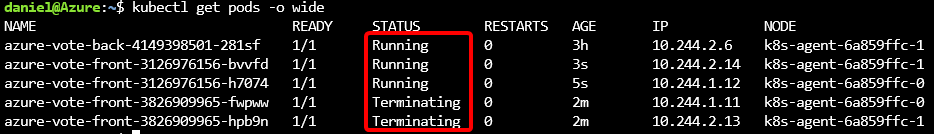

1. We can now watch the rolling deployment of our new application by running
   this command in the Azure Cloud Shell:

   ```bash
   kubectl get pods -o wide --watch
   ```

1. Once all Pods report a status of `Running` press <kbd>CTRL+C</kbd> to
   exit watching.

   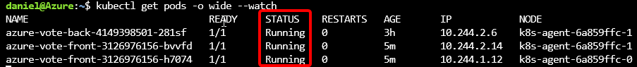

1. Now head back over to your running application in the browser and
   refresh the window to see the new version of your application
   running:

   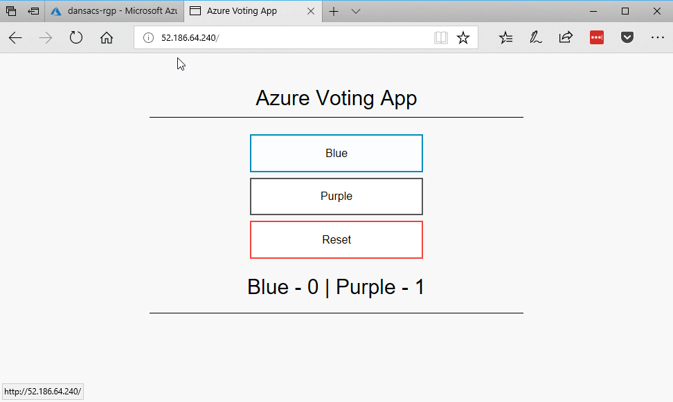

1. You can redeploy the previous version image by running this
   command in the Cloud Shell:

   ```bash
   kubectl set image deployment azure-vote-front azure-vote-front=microsoft/azure-vote-front:v1
   ```

## Part 7 - When Disaster Strikes

So, what happens when disaster strikes and one of your Kubernetes agents
(_Nodes_) goes down - or if you just need to take it out of the cluster to
update it?

This is where Kubernetes really shines - it will always make sure the desired
number of replicas are running for each _Pod_ in your _Deployment_, no matter
how many agents you have available.

If a _Node_ becomes unresponsive for 5 minutes then Kubernetes will automatically
evict it from the cluster and move all the running _Pods_ to another _Node_.
This will keep your systems running and reliable if unexpected outages occur.

If you're planning on performing maintainence on a _Nodes_ in your cluster
then typically you'd want to _Drain_ the _Nodes_ first. This ensures there
will be no service disruption. So let's see this in action.

1. First have a look at the containers that are running on our _Nodes_
   by executing this command in Cloud Shell:

   ```bash
   kubectl get pods -o wide
   ```

   You'll see that they're spread accross the two running _Nodes_.

   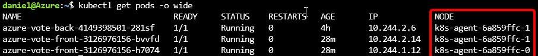

1. To make things a little bit easier we'll assign the name of
   one of our _Nodes_ to a variable by running this command in
   the Cloud Shell:

   ```bash
   nodename="k8s-agent-6a859ffc-1"
   ```

1. Now, lets _Drain_ one of the _Nodes_ by running this command in

   ```bash
   kubectl drain $nodename
   ```

   This stops new _Pods_ from being deployed to this _Node_, but
   leaves the existing _Pods_ running on it.

1. Lets simulate a complete failure of the _Node_ by shutting
   down the VM:

   Get the name of one of your _Nodes_ from the result of the
   previous command and execute this command (changing the `--name` parameter
   value to that of the _Node_ to stop):

   ```bash
   az vm stop --resource-group $name-rgp --name $nodename
   ```

1. It will take 5 minutes for the Kubernetes cluster to determine
   that the _Node_ is no longer available. At this point it will
   redeploy all the _Pods_ to the other running _Nodes_ and mark
   the failed _Pods_ as status `Unknown`:

   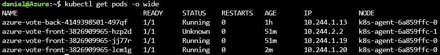

1. We will now start the VM back up (changing the `--name` parameter
   value to that of the _Node_ to start):

   ```bash
   az vm start --resource-group $name-rgp --name $nodename
   ```

1. A _Node_ that has been shutdown without removing it from the cluster
   will result in a status of `SchedulingDisabled`. Before the Kubernetes
   _Scheduler_ will start using it again we must _Uncordon_ the node

   ```bash
   kubectl uncordon $nodename
   ```

## Step 8 - Using Helm

Helm is essential a package management system for Kubernetes. It makes
locating and installing services into Kubernetes really easy. Helm
uses Helm charts to define Kubernetes services. The Helm management
tool is already installed in the Azure Cloud Shell, but can also be
installed onto a client machine.

1. Initialize helm by running the command:

   ```bash
   helm init
   ```

| To install the Helm Tiller with RBAC enabled into a specific namespace use:

   ```bash
   kubectl create namespace tiller-world
   kubectl create serviceaccount tiller --namespace tiller-world
   kubectl create -f src\role-tiller.yaml
   kubectl create -f src\rolebinding-tiller.yaml
   helm init --service-account tiller --tiller-namespace tiller-world
   ```

2. To install and run Grfana:

   ```bash
   helm install stable/grafana --tiller-namespace tiller-world --namespace tiller-world --set "service.type=LoadBalancer,persistence.enabled=true,persistence.size=10Gi,persistence.accessModes[0]=ReadWriteOnce"
   ```

## Step 99 - Cleanup After the Workshop

> This step is optional and only needs to be done if you're finished with your
> cluster and want to get rid of it to save some Azure credit.

_Note: If you just want to pause running your cluster, you can actually go in and
shut each of the cluster VMs down. This will reduce some compute costs but won't
completely delete the cluster. You will still pay for some components._

1. Delete the cluster by running the following command in the Azure Cloud Shell:

   ```bash
   az acs delete --resource-group $name-rgp --name $name --yes
   ```

2. Delete the resource group by running this command in the Azure Cloud Shell:

   ```bash
   az group delete --name $name-rgp --yes
   ```


Everything will now be cleaned up and deleted and you won't be paying to run
an ACS Kubernetes cluster.


**Well done!**
You have taken your first steps into the amazingly powerful world of
Containers, Kubernetes and Azure Container Service. This technology is
increadibly powerful and can allow your applications to run virtually
anywhere and they will always run the same way.

Thank you!
