# Containerize Your World using Azure Kubernetes Services

This session will show you how to get started with Azure Container Service (AKS),
one of the most powerful ways of running containerized applications in Azure.
You'll learn how to set up a Kubernetes cluster using the Azure Cloud Shell and
deploy a highly available and scalable web application with only a few commands.
We'll then show how easy it is to install Grafana into your cluster using
Helm and then scale it up. We will then connect Grafana to our Azure subscription
and use to build some great dashboards from our Azure Analytics.

_[Grafana](https://grafana.com/) is an open platform for beautiful analytics and monitoring and also
provides an [Azure Monitoring](https://grafana.com/plugins/grafana-azure-monitor-datasource) plugin._

**Daniel Scott-Raynsford**

_Continuous Delivery Practice Lead, IAG NZ_

[Microsoft Cloud and Datacenter MVP](https://mvp.microsoft.com/en-us/PublicProfile/5002340?fullName=Daniel%20%20Scott-Raynsford) | [@dscottraynsford](https://twitter.com/dscottraynsford) | [Linked-In](https://www.linkedin.com/in/dscottraynsford/) | [Email](mailto:dscottraynsford@outlook.com) | [GitHub](https://www.github.com/PlagueHO)

## Content

- [What You Will Need](#what-you-will-need)
- [Prerequisite Knowledge](#prerequisite-knowledge)
- [What You Will Learn](#what-you-will-learn)
- [Part 1 - Opening a Cloud Shell](#part-1---opening-a-cloud-shell) - 5 min
- [Part 2 - Create an Azure Container Service](#part-2---create-the-azure-container-service) - 30 min
- [Introduction to Containers, Docker and Kubernetes](#introduction-to-containers,-docker-and-kubernetes) - 30 min
- [Part 3 - Manage Cluster with Cloud Shell](#part-3---manage-cluster-with-cloud-shell) - 5 min
- [Part 4 - Configure Helm Tiller](#part-4---configure-helm-tiller) - 5 min
- [Part 5 - Install Grafana using Helm](#part-5---install-grafana-using-helm) - 10 min
- [Part 6 - Connect Grafana to Azure](#part-6---connect-grafana-to-azure) - 5 min
- [Part 8 - Cleanup After the Workshop](#part-8---cleanup-after-the-workshop) - 5 min

Estimated workshop time: 90 min
Estimated Azure credit usage: USD 3.00 (as long as you delete
the infrastructure straight after completion of the workshop)

## Prerequisite Knowledge

- Basic knowledge of Compute and Virutalization (Hyper-V, VMWare, Cloud compute)
- Basic knowledge of text editors (Notepad++ or Vim or VS Code)
- Basic knowledge of using text based consoles (Bash, Cmd, PowerShell)

## What You Will Learn

You'll learn the basics in the following skills:

- Create and use the Azure Cloud Shell.
- Use the Azure CLI (`az`) to create and delete an Azure Container Service.
- Use the Kubernetes tools (`kubectl`) to deploy and manage highly available
  container applications.
- Use the Helm tool (`helm`) to deploy and manage a highly available Grafana
  cluster and connect it

## What You Will Need

To complete this workshop you'll need the following:

- A **Microsoft Azure Account**.
  You can sign up for a free trial [here](https://azure.microsoft.com/en-us/free/).
- A computer running **Windows**, **OSX** or **Linux** (desktop OS)
  with an **up-to-date version** of either Chrome, Firefox, Edge or Opera.

## Part 1 - Opening a Cloud Shell

Azure Cloud Shell is an interactive, browser-accessible shell for managing
Azure resources. It provides the flexibility of choosing the shell experience
that best suits the way you work. Linux users can opt for a Bash experience,
while Windows users can opt for PowerShell.

1. Open Cloud Shell by clicking the Cloud Shell icon:
   

> If you have **not** previously used Azure Cloud Shell:

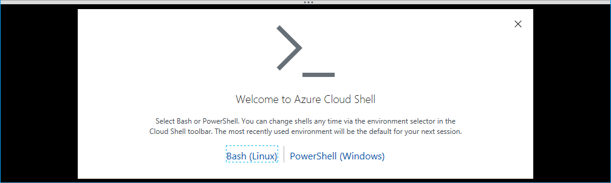

1. Click **Bash (Linux)**

   _When you first create a Cloud Shell a storage account will get created
   for you to store your settings, scripts and other files you might create. This
   enables you to have access to your own environment no matter what device you're
   using._

   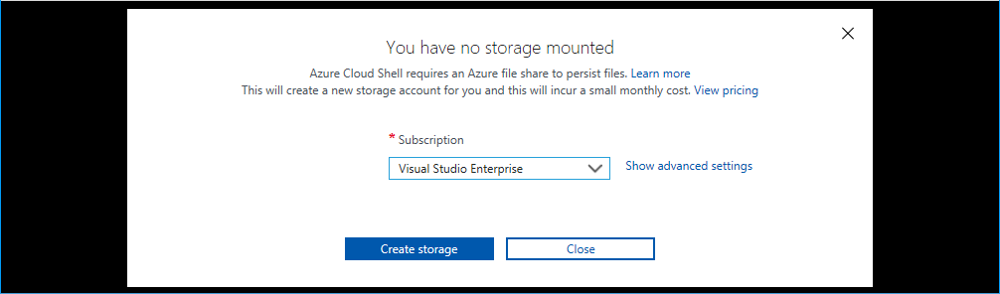

1. Select the **subscription** to create the Storage Account in and click
   **Create storage**.
1. The Storage Account will be created and the Cloud Shell will be started:

   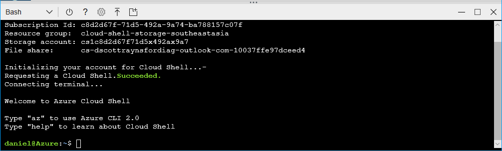

> If you have previously used Azure Cloud Shell:

1. Select **Bash** from the shell drop down:

   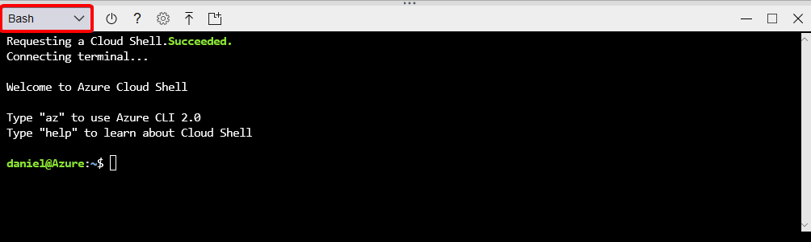

## Part 2 - Create an Azure Container Service

We will now use the Cloud Shell to create a new Azure Container Service (ACS)
Kubernetes cluster that will be used to host our containers.

Any ACS service you create will be publically accessible on the internet.
A URL will be automatically assigned to your ACS service that you will be
able to use to access your containers and manage your cluster.

1. Launch an **Cloud Shell** in the Azure Portal or as a standalone console:

   [](https://shell.azure.com)

1. Depending on your type of subscription (Free, Azure Pass etc.) you may
   have to register the required resource providers. This is because by
   default many resource providers (types of resource providers) are not
   registered by default.

   This only needs to be done once for a subscription. To do this, run
   the following commands in Cloud Shell:

   ```bash
   az provider register --namespace Microsoft.Network
   az provider register --namespace Microsoft.Compute
   az provider register --namespace Microsoft.Storage
   az provider register --namespace Microsoft.ContainerService --wait
   ```

   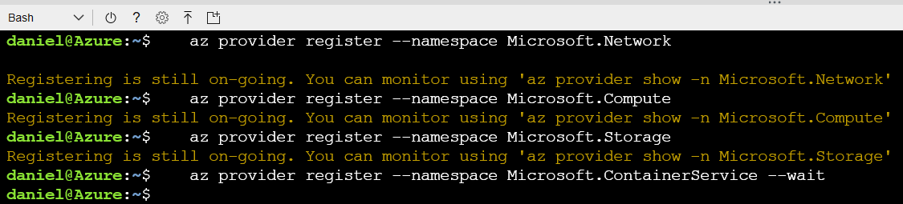

1. Come up with a **name** for your Azure Kubernetes Service. The name must contain
   only letters and numbers and be globally unique because it will be used for
   the public URLs of your cluster.

1. Run this command in Cloud Shell, but change `<set me please>` to the
   **name** that you specified above.

   ```bash
   name="<set me please>"
   location="EastUS"
   ```

   **Important: Please note this value and command down, because if your Cloud
   Shell closes the value will be removed and you'll have to define it in your
   Cloud Shell session again by re-running this command.**

1. Run this command your Cloud Shell to create a resource group:

   ```bash
   az group create --name $name-rgp --location $location
   ```

1. Run this command in Cloud Shell to create a Azure Kubernetes Service
   cluster:

   ```bash
   az aks create --name $name --resource-group $name-rgp --location $location --dns-name-prefix $name --generate-ssh-keys --node-count 2 --node-vm-size Standard_DS2_v3
   ```

   | Note: If you have an Azure Log Analytics workspace you'd like to
   configure your cluster to log to, you can include the `--workspace-resource-id`
   and `--enable-addons monitoring` parameters in the create command:

   ```bash
   workspaceId="$(az resource list --resource-type Microsoft.OperationalInsights/workspaces --query '[0].id' --o tsv)"
   az aks create --name $name --resource-group $name-rgp --location $location --dns-name-prefix $name --generate-ssh-keys --node-count 2 --node-vm-size Standard_D2s_v3 --workspace-resource-id $workspaceId --enable-addons monitoring --kubernetes-version 1.10.5
   ```

The AKS cluster will be created in your Azure subscription.
This will take at least 10 minutes to complete creation of the AKS.

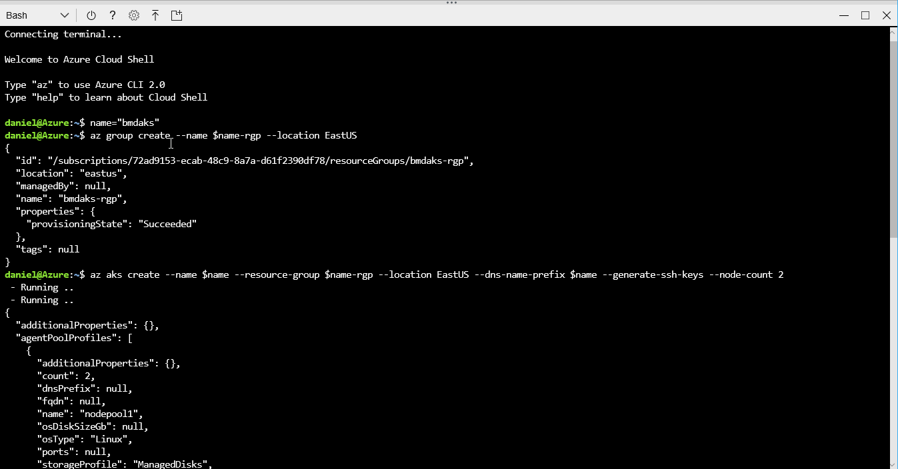

## Part 3 - Manage Cluster with Cloud Shell

Once your AKS has been created you will be able to review the AKS serivce
resource that has been created:

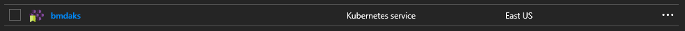

The actual infrastructure running the cluster gets installed into another
resource group:

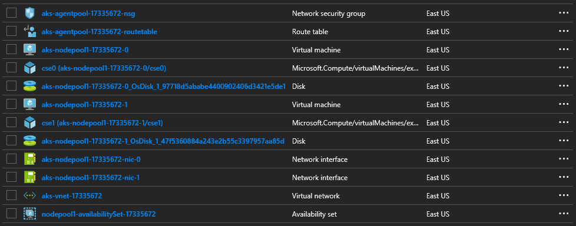

The cluster itself should be managed by the AKS resource, not within the actual
infrastructure deployed.

Now that our cluster is deployed we need to configure Cloud Shell to be able
to manage it.

Kubernetes clusters always expose a management endpoint that the Kubernetes tools
and other software can use to control and monitor the cluster with. The FQDN
for this endpoint can be located by selecting the AKS cluster resource in the
resource group that we deployed to contain our cluster:


We can then configure the `kubectl` tool to manage this cluster. We could do this
manually, but the `Azure CLI` in Cloud Shell provides a handy way to do this for us.

1. Configure your Cloud Shell to manage your ACS by running the command:

   ```bash
   az aks get-credentials --resource-group $name-rgp --name $name
   ```

   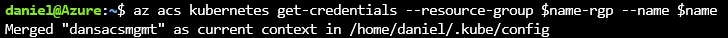

1. Validate our cluster is running by running the command:

   ```bash
   kubectl cluster-info
   ```

   

1. Check all nodes in the cluster by running the command:

   ```bash
   kubectl get nodes
   ```

## Part 4 - Configure Helm Tiller

Helm is essentially a package management system for Kubernetes. It makes
locating and installing services in Kubernetes even easier as well as
simplifying the updating and upgrading of deployed services.
The Helm management tool is already installed in the Azure Cloud Shell,
but can also be installed onto a client machine (Windows, MacOS and Linux).

Normally, Helm can just be enabled and installed using `helm init`.
However, this will install into the `default` Kubernetes _namespace_ which
we can't enable role based access (RBAC) control on. The Grafana Helm chart
requires RBAC so we'll need to create a new Kubernetes _namespace_ called
`tiller-world` to install it into.

| Important: as of 2018-07-14, there is an issue with the way Azure deploys
an AKS cluster with RBAC enabled. It is missing the `cluster-admin` role
which _Helm_ assumes exists. To resolve this issue, create the `cluster-admin`
role by running:

   ```bash
   kubectl create -f https://raw.githubusercontent.com/PlagueHO/Workshop-AKS/master/src/helm/cluster-admin.yaml
   ```

1. Initialize the Helm Tiller with role based access control enabled into
   a the `tiller-world` _namespace_ with:

   ```bash
   kubectl create namespace tiller-world
   kubectl create serviceaccount tiller --namespace tiller-world
   kubectl create -f https://raw.githubusercontent.com/PlagueHO/Workshop-AKS/master/src/helm/role-tiller.yaml
   kubectl create -f https://raw.githubusercontent.com/PlagueHO/Workshop-AKS/master/src/helm/rolebinding-tiller.yaml
   helm init --service-account tiller --tiller-namespace tiller-world
   ```

### Part 5 - Install Grafana using Helm

Next, we'll install an instance of Grafana into our cluster using Helm
and then scale up the _replica set_ to run 2 _replicas_. We need to pass
some configuration information to Helm to tell it how to configure our
Grafana service, such as the plugins to include.

1. To install and run Grfana:

   ```bash
   helm install stable/grafana --tiller-namespace tiller-world --set "service.type=LoadBalancer,persistence.enabled=true,persistence.size=10Gi,persistence.accessModes[0]=ReadWriteOnce,plugins[0]=grafana-azure-monitor-datasource,plugins[1]=grafana-kubernetes-app"
   ```

2. Set a variable name from the name of the Grafana service that
   was started by helm:

   ```bash
    serviceName="silly-mole-grafana"
   ```

3. Scale out the Grafana dashboard to two replicas:

   ```bash
   kubectl scale deployment --namespace tiller-world $serviceName --replicas=2
   kubectl get pods --namespace tiller-world
   ```

4. To get IP Address of the Grafana server:

   ```bash
   kubectl get service --namespace tiller-world $serviceName -o jsonpath="{.status.loadBalancer.ingress[0].ip}"; echo
   ```

5. To get `admin` account password Grafana server:

   ```bash
   kubectl get secret --namespace tiller-world $serviceName -o jsonpath="{.data.admin-password}" | base64 --decode ; echo
   ```

6. Open the IP address from _step 4_ in a web browser and enter
   the username `admin` and the password from _step 5_.

   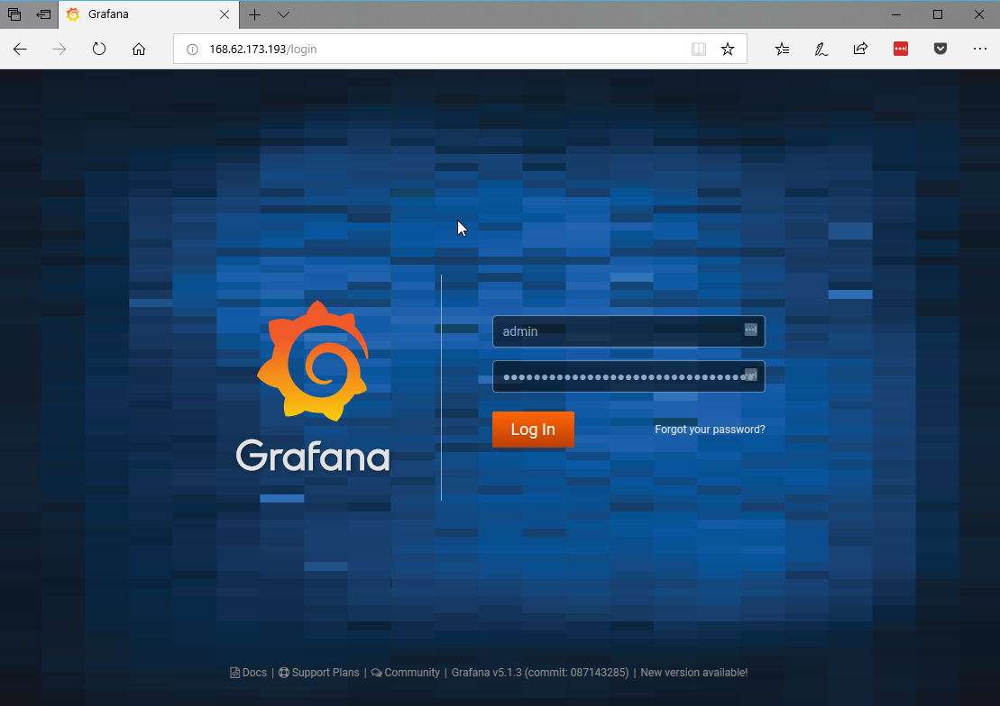

### Part 6 - Connect Grafana to Azure

Now that our Highly Available Grafana service is running in our AKS cluster
we need to connect it to our Azure subscription. This will allow Grafana
to ingest monitoring information from Azure.

The Grafana [Azure Monitor](https://azure.microsoft.com/en-us/blog/monitor-azure-services-and-applications-using-grafana/)
datasource will require an Azure Service Principal details it can use to
connect to Azure.

1. To create a new Service Principal run the following commands in
  the Azure Cloud Shell:

   ```bash
   clientKey="<set this to a long password>"
   appName="GrafanaAzureMonitor"
   az ad app create --display-name $appName --homepage "http://localhost/$appName" --identifier-uris "http://localhost/$appName"
   appId=$(az ad app list --display-name $appName --query [].appId -o tsv)
   az ad sp create-for-rbac --name $appId --password $clientKey
   ```

   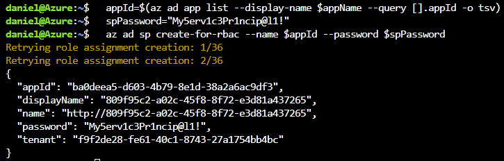

2. You will need to record the following four values from the service
   principal:

   a. Subsription Id - can be found by running:

      ```bash
      az account list
      ```

   b. Tenant Id - returned as the `tenant` from the output in _Step 1_.
   c. Client Id - returned as the `appId` from the output in _Step 1_.
   d. Client Secret - set in the `clientKey` variable in _Step 1_.

3. In Grafana, click the settings (cog) icon and then click `Add data
   source`:

   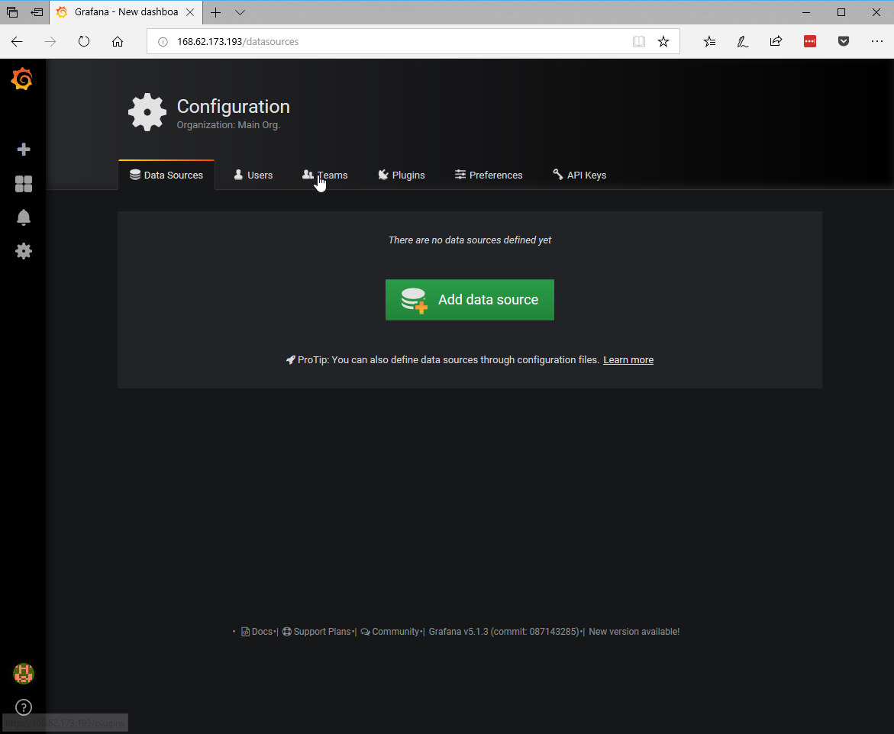

4. Set `Azure Monitor` as the _Type_:

   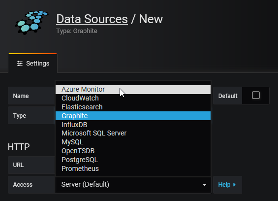

5. Enter a _Name_ for the datasource and complete the `Azure Monitor API
   Details` as per the values found in _Step 2_.

   | Note: You don't need to complete the Application Insights details
   | unless you have one you want to ingest information into.

   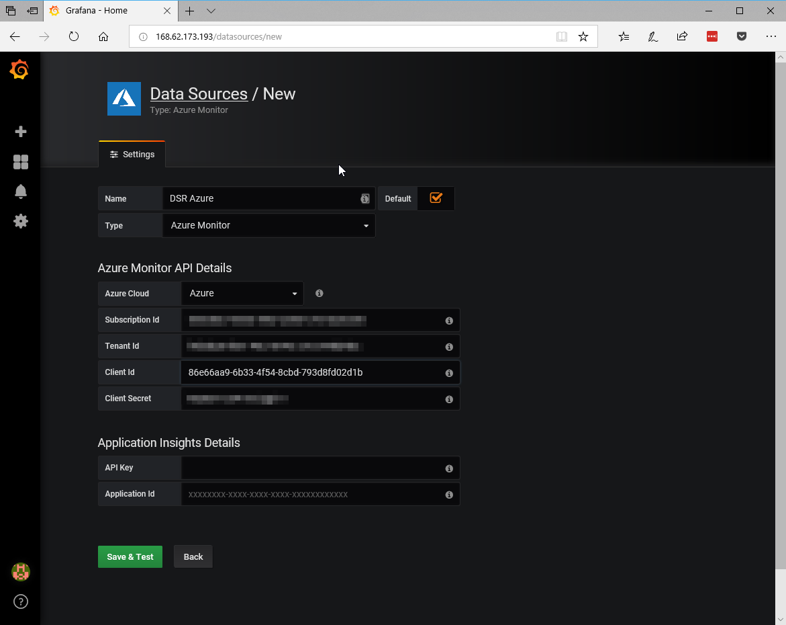

6. Click the `Save & Test` button:

   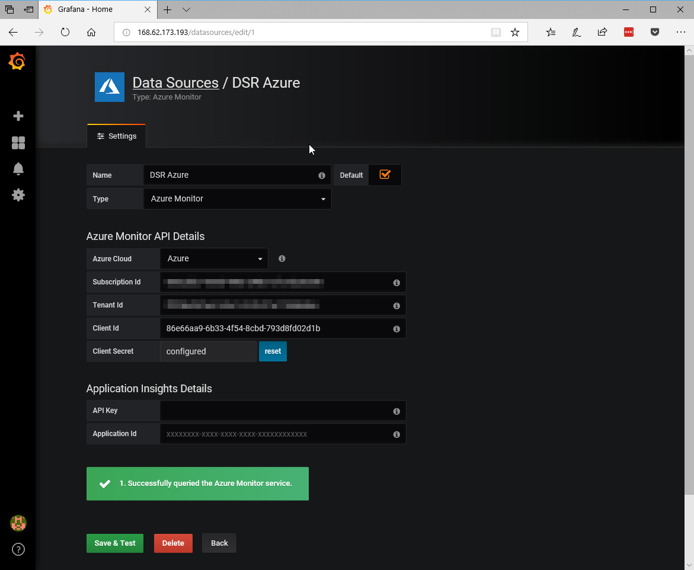

If everything has gone to plan, then you have now connected your Grafana
service to Azure and you can now create dashboards with it.

Now you're able to create some dashboards to monitor your services
in Azure:

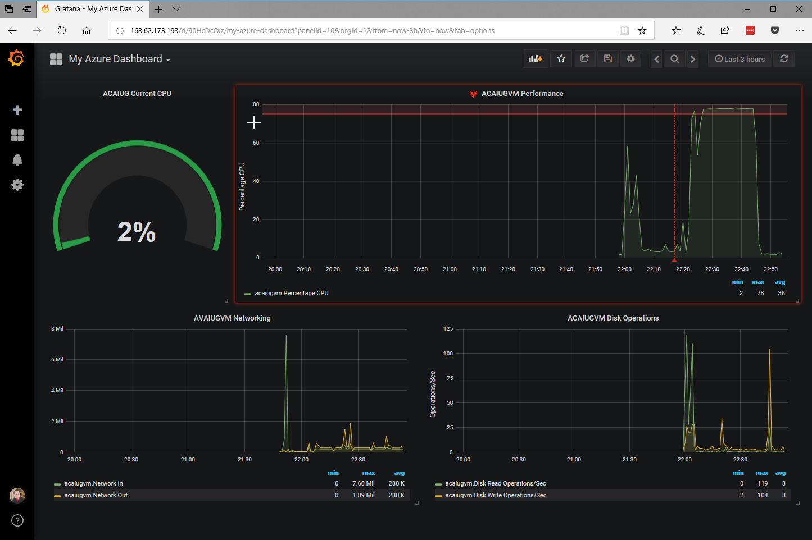

If you're new to Grafana, then it is best to look through the Grafana
[getting started guide](http://docs.grafana.org/guides/getting_started/).

### Part 7 - Add Some More Workloads

One of the most useful and powerful things about _AKS_ and _Kubernetes_
in general is you can simply continue to add workloads (apps/services)
to your cluster if you've got spare capacity on it. And of course
you can continue to add _Nodes_ if you start to run low on capacity.

Adding another workload to an existing cluster is simple with Helm.

1. Add a Wordpress Application to your cluster:

   ```bash
   helm install stable/wordpress --tiller-namespace tiller-world
   ```

## Part 8 - Cleanup After the Workshop

> This step is optional and only needs to be done if you're finished with your
> cluster and want to get rid of it to save some Azure credit.

_Note: If you just want to pause running your cluster, you can actually go in and
shut each of the cluster VMs down. This will reduce some compute costs but won't
completely delete the cluster. You will still pay for some components._

1. Delete the cluster by running the following command in the Azure Cloud Shell:

   ```bash
   az acs delete --resource-group $name-rgp --name $name --yes
   ```

2. Delete the resource group by running this command in the Azure Cloud Shell:

   ```bash
   az group delete --name $name-rgp --yes
   ```

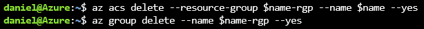

Everything will now be cleaned up and deleted and you won't be paying to run
an ACS Kubernetes cluster.


**Well done!**
You have taken your first steps into the amazingly powerful world of
Containers, Kubernetes and Azure Container Service. This technology is
increadibly powerful and can allow your applications to run virtually
anywhere and they will always run the same way.

Thank you!
